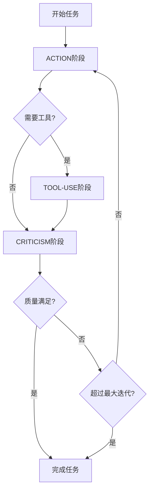

# LangGraph ACT Agent (MCP版) 使用说明

## 📋 概述

ACT Agent是基于LangGraph框架实现的智能代理，采用Action-Criticism-Tool-use（行动-批评-工具使用）模式，能够自主完成复杂任务并持续改进。本版本集成了MCP（Model Context Protocol）工具，可以直接控制Android设备进行自动化测试和操作。

## 🏗️ 架构设计

### 核心组件

1. **Action（行动）阶段**
   - 分析任务需求
   - 制定具体行动计划
   - 模拟执行并记录结果

2. **Criticism（批评）阶段**
   - 评估执行质量
   - 识别问题和改进点
   - 决定是否需要进一步迭代

3. **Tool-use（工具使用）阶段**
   - 智能选择合适的工具
   - 执行工具调用
   - 收集工具执行结果

### 状态管理

```python
class ACTState(TypedDict):
    task_description: str      # 任务描述
    current_phase: str         # 当前阶段
    action_plan: Dict[str, Any]    # 行动计划
    execution_result: Dict[str, Any]   # 执行结果
    criticism: Dict[str, Any]      # 批评评估
    tool_usage: List[Dict[str, Any]]   # 工具使用记录
    iteration_count: int       # 迭代次数
    is_complete: bool         # 是否完成
    confidence_score: float   # 置信度分数
    messages: List[Any]       # 对话历史
```

## 🔧 工具箱

### MCP工具（移动设备控制）

1. **take_screenshot**: 设备截图
   - 获取Android设备当前屏幕截图
   - 自动保存到本地screenshots目录

2. **click_screen**: 点击屏幕
   - 在指定坐标点击设备屏幕
   - 支持精确坐标定位

3. **input_text**: 输入文本
   - 在设备当前输入框输入文本
   - 支持中英文输入

4. **wake_screen**: 唤醒屏幕
   - 唤醒设备屏幕
   - 解锁屏幕保护

5. **go_home**: 回到主屏幕
   - 返回Android设备主屏幕
   - 相当于按Home键

### 本地工具

1. **calculator**: 数学计算器
   - 安全的数学表达式计算
   - 支持基本算术运算

## 🚀 快速开始

### 1. 安装依赖

```bash
pip install -r requirements.txt
```

### 2. 配置文件

确保有正确的`config.json`配置文件：

```json
{
    "openai": {
        "api_key": "your-api-key",
        "base_url": "your-base-url",
        "model": "gpt-4o",
        "temperature": 0.3,
        "max_tokens": 2000
    },
    "client": {
        "mcp_server_url": "http://127.0.0.1:8568/sse",
        "screenshot_dir": "screenshots"
    },
    "adb": {
        "device_id": "127.0.0.1:5555"
    }
}
```

### 3. 启动MCP服务器

在运行ACT Agent之前，需要先启动MCP服务器：

```bash
# 启动ADB MCP服务器（需要另开终端）
python util/adb_mcp_driver.py
```

### 4. 运行演示

```bash
python langgraph_act_agent_demo.py
```

选择演示模式：
- **1**: 完整版-MCP工具 - 使用gpt-4o进行完整的ACT循环，集成真实设备控制
- **2**: 简化版 - 快速演示ACT流程，不需要LLM配置和MCP连接

### 前置条件

运行完整版需要：
1. ✅ Android设备或模拟器已连接
2. ✅ ADB调试已启用
3. ✅ MCP服务器正在运行
4. ✅ config.json配置正确
5. ✅ 网络连接正常（调用GPT-4o）

## 📊 执行流程



## 💡 使用示例

### 示例任务

1. **移动设备自动化测试**
   - Action: 分析测试需求，制定测试步骤
   - Tool-use: 截图、点击屏幕、输入文本
   - Criticism: 评估测试覆盖率和操作准确性

2. **应用界面探索**
   - Action: 制定界面探索策略
   - Tool-use: 唤醒屏幕、截图分析、交互操作
   - Criticism: 评估探索的完整性和有效性

3. **设备状态监控**
   - Action: 设计监控方案
   - Tool-use: 定期截图、状态检查、回到主屏幕
   - Criticism: 评估监控的实时性和准确性

### 输出示例

```
🤖 ACT Agent 开始处理任务
🎯 任务: 制作一个简单的Python计算器程序
============================================================
🎯 ACTION阶段 - 迭代 1
   制定行动计划：创建内容
🔧 TOOL_USE阶段 - 使用工具
   使用工具: search_web - 完成
   使用工具: file_manager - 文件创建成功
🔍 CRITICISM阶段 - 评估结果
   质量评估：良好 (评分: 8.5)
✅ COMPLETE阶段 - 任务完成
   📊 任务总结：
      - 迭代次数: 0
      - 最终置信度: 0.85
      - 工具使用: 2 次
      - 质量评估: 良好 (8.5/10)
```

## 🔄 自适应循环

ACT Agent具有自适应循环能力：

1. **质量检查**: 每次迭代后自动评估质量
2. **智能停止**: 当质量达标或达到最大迭代次数时停止
3. **持续改进**: 根据批评意见调整后续行动

### 停止条件

- 质量评分 ≥ 8.0/10
- 批评阶段建议停止
- 达到最大迭代次数（3次）

## 🎯 扩展性

### 添加新工具

```python
@staticmethod
def new_tool(param: str) -> Dict[str, Any]:
    """新工具实现"""
    return {
        "tool": "new_tool",
        "result": "工具执行结果",
        "timestamp": datetime.now().isoformat()
    }
```

### 自定义评估标准

可以修改`_criticism_phase`方法中的评估逻辑，添加特定领域的评估标准。

### 集成外部API

可以扩展工具箱，集成真实的搜索API、数据库连接等外部服务。

## 🚨 注意事项

1. **配置检查**: 确保config.json配置正确
2. **网络连接**: 完整版需要网络连接调用LLM
3. **依赖安装**: 确保安装了所有必要的依赖包
4. **安全性**: 计算器工具已添加安全检查，避免执行危险代码

## 📚 技术特性

- **异步处理**: 支持异步LLM调用
- **状态持久化**: 使用LangGraph的MemorySaver
- **条件分支**: 智能路由决策
- **错误处理**: 完善的异常处理机制
- **中文支持**: 全中文界面和文档

## 🎉 总结

ACT Agent展示了LangGraph在构建复杂AI工作流方面的强大能力，通过Action-Criticism-Tool-use模式实现了智能任务处理和持续改进，是开发高级AI代理系统的良好实践。 